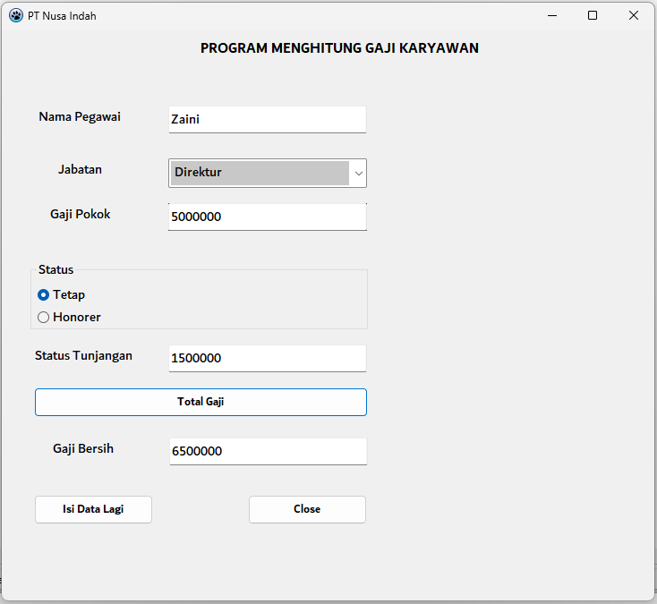
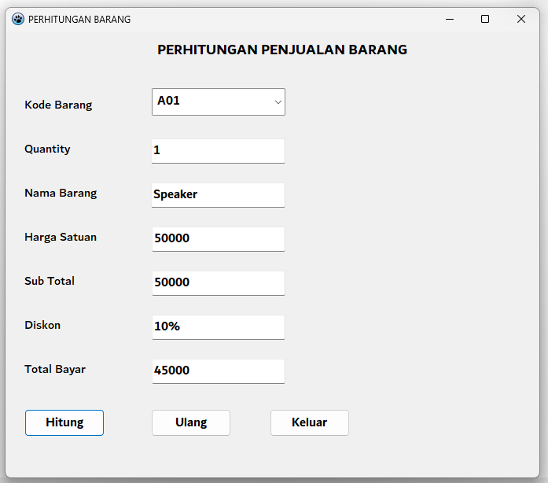

# Latihan 2 - Pemograman Visual ( Dekstop )

**_Nama : Zaini Muhtarom_**  
**_NIM : 312110294_**  
**_Kelas : TI.21.A3_**  

## Result Menghitung Gaji Karyawan

## Result Penjualan Barang

## Result Menghitung Deret N
